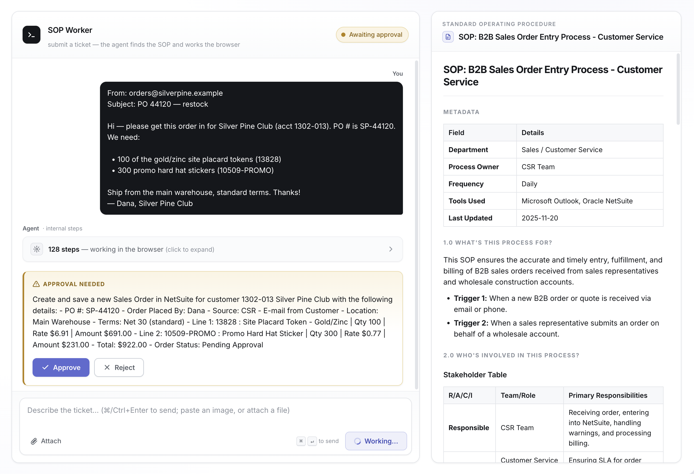

## SOP automation based on observation

This repo shows that you can automate any browser-based back-office process using the Claude SDK, and create a working, reliable and verified agentic automation within a day. All you need is context (observations of how work gets done).
The agent follows SOPs (Standard Operating Procedures) to perform a process exactly as it's being done at a specific company. The automation is fully open source.

The solution is closer to a digital intern / agentic coworker than traditional automation because:
* the automation builds itself per task, based on a SOP, within 1 minute 
* it adapts to previously unknown edge cases
* it self-repairs
* it is more reliable because it understands the broader context of the company

The blueprint for the automation solution is encoded in [spec.md](spec.md)  




## Getting started

The public repo contains the reusable pieces — the **worker** (`@sop/worker`), the **chat UI** (`ui/`), the **eval runner + LLM judge** (`tests/`), the vendored browser tool (`vendor/browser-harness`, from [Browser Use](https://github.com/browser-use), MIT), and the mock NetSuite **gym** (`gym/`) so the eval is fully reproducible. The raw source dataset the gym was modelled from (`inputs/` — real transcripts, SOPs and screenshots) stays private. To automate your own work, point the worker at **your own** SOP catalog and **your own** target site (see *Point it at your own work* below).

> **The worker never reads the gym.** It runs with `settingSources: []`, is sandboxed to `Read`/`Glob`/`Grep` plus its four MCP tools, has no imports from `gym/`, and receives only the ticket, attachments, `SOP_DIR` and `TARGET_URL`. The answer key in `gym/scenarios/` cannot leak into the agent — every run rediscovers the task from scratch.

### Prerequisites

- Node ≥ 20 and `pnpm` (`pnpm@10.12.4`)
- Python + [`uv`](https://docs.astral.sh/uv/) — drives the vendored `browser-harness`
- A local Chrome / Chromium
- Claude auth: log in once with the `claude` CLI, or set `ANTHROPIC_API_KEY`

### Install

```bash
pnpm install
cp .env.example .env   # optional — only to override default URLs/model
```

### Run the demo stack

```bash
scripts/dev.sh                     # dedicated Chrome (:9222) + mock gym (:5180) + chat UI (:5190)
# CHROME_HEADLESS=0 scripts/dev.sh # watch the worker drive the browser
```

Open the chat UI at http://127.0.0.1:5190, paste a ticket (optionally attach an Excel sheet or an image), and watch the worker pick the matching SOP, drive the browser, and stop for your approval before it commits anything. Or run the pieces individually:

```bash
pnpm mock:dev                  # just the mock NetSuite gym (:5180)
pnpm ui:dev                    # just the chat UI (:5190)
scripts/chrome.sh start|stop   # the worker's dedicated debug-port Chrome
```

### Point it at your own work

The worker has no built-in knowledge — it learns each task from the ticket, your SOPs, and what it sees in the browser. Configure it via `.env` (see `.env.example`):

- `SOP_DIR` — folder of SOP markdown files the worker is mandated to follow

[`assets/B2B_Sales_Order_Entry__Base_Process.md`](assets/B2B_Sales_Order_Entry__Base_Process.md) is included as a **reference SOP** so you can see the expected shape and level of detail. It is only an example — to automate your own work you must provide your **own** SOPs that document your processes.

- `TARGET_URL` — the web app the worker operates
- `CDP_URL` — the dedicated Chrome it controls (default `http://127.0.0.1:9222`)
- `MODEL` — driving model (default `claude-sonnet-4-6`)

### Test & validate

```bash
pnpm eval                                  # run the worker against scenarios + LLM judge
pnpm lint && pnpm format:check && pnpm typecheck
```

`pnpm eval` needs the stack running (`scripts/dev.sh`) and grades the private gym scenarios by default; point `SCENARIOS` at your own scenario file to grade your own processes.

## How it was built

Claude Opus 4.8 in ultracode mode implemented:
* a mock ERP, built from scratch based on screenshots
* an e2e test suite that tests the agent based on SOPs 
* a working agent that can be demonstrated on test inputs which it has never seen before

Claude was started with this prompt:  
/goal The goal is to implement, review, test and validate @spec.md. Use dynamic workflows. Keep iterating until you can validate that the agent worker can perform SOP related tickets against the mock environment with a high success rate. The mock environment must be closely resembling the screenshots and supports all mock test scenarios. Multiple qualitative test cases have been developed and successfully executed. Claude has worked diligently and made no shortcuts nor fake implementations. Issues in the agents implementation have been found and addressed in a generic way, such that the agent worker has absolutely no prior knowledge about the task or environment that it will be executed against, it must learn how to solve the challenge by itself, every time.

Then one more prompt for polishing things:  
/frontend-design explore the design of the agent worker ui via headless browser, then make it beautiful, minimalistic, functional, easy to understand and user friendly with a light and modern theme. Explore multiple designs in parallel, then use a judge to pick the best one. Implement the best design, review and validate it. Execute the full test suite to ensure it is still handling all cases.
